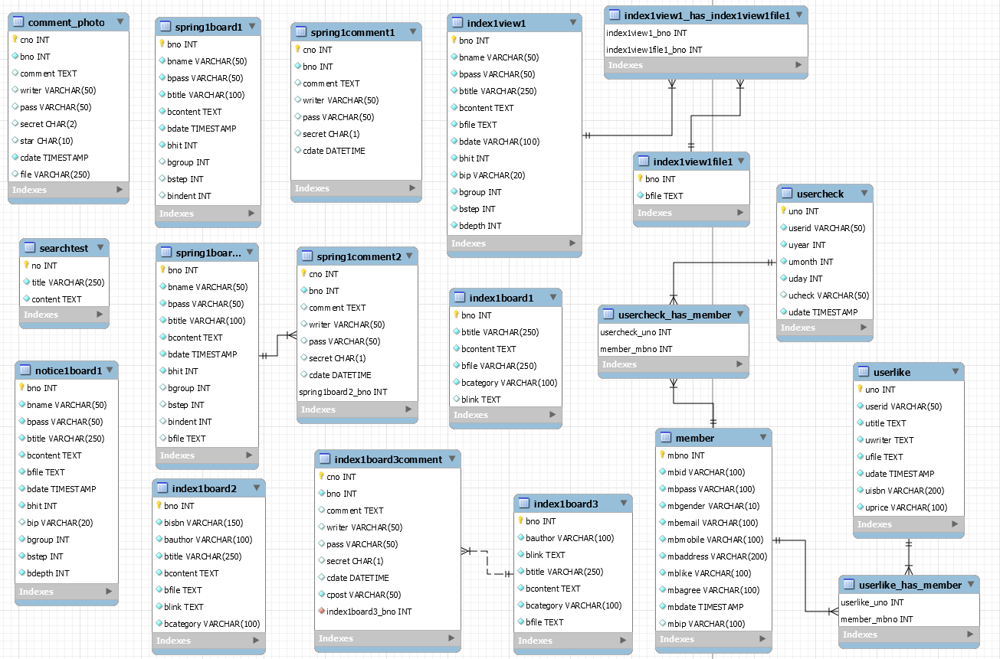

# 📚 북마켓 (BOOK MARKET)

> 독서 증진 도서 감성 커뮤니티 사이트

**[화면 미리보기](https://ejlee8796.github.io/jsp-spring-bookmarket/)**

<br>

## 프로젝트 개요

| 항목 | 내용 |
|------|------|
| 프로젝트명 | 북마켓 (BOOK MARKET) |
| 제작 기간 | 2019.04.22 ~ 2019.08.13 |
| 참여도 | 개인 프로젝트 (100%) |
| 수료과정 | 오라클 기반 SPRING 프레임워크 개발자(자바) |

<br>

## 제작 동기

많은 사람들이 취미생활로 책을 선호하며 즐기는 것을 보고, 책을 읽고 싶은 사람들과 그러한 취미를 공유하고자 하는 사람들을 위해 독서생활을 독려하는 북 감성 커뮤니티 사이트를 제작하였습니다.

- 비회원도 책 검색 및 책 정보 열람 가능
- 회원가입 후 커뮤니티 게시판에서 글 등록 및 정보 공유 가능
- eBook을 통해 책이나 소설을 읽고 서로 추천하는 문화를 온라인으로 구현

<br>

## 기술 스택

### Backend


### Frontend


### 개발 환경
- **WAS** : Tomcat 8.0.x
- **JSP** : 2.3 / **Servlet** : 3.1
- **JDK** : 1.8.x
- **IDE** : Eclipse
- **Framework** : Spring, MyBatis
- **Database** : MySQL
- **Web** : HTML5, CSS, JavaScript, jQuery, Ajax, JSP, JSON, JSTL, EL

<br>

## 기술 숙련도

| 기술 | 숙련도 |
|------|--------|
| Java | ████████████████████ 90% |
| AJAX | ████████████████████ 90% |
| Spring | ███████████████████ 85% |
| JSP | ███████████████████ 85% |
| JSON | ███████████████████ 85% |
| MySQL | ██████████████████ 80% |
| API | ██████████████████ 80% |

<br>

## 주요 기능

### 1. AJAX 페이징 처리
새로고침 없이 원하는 부분만 화면이 바뀌도록 AJAX를 이용하여 페이징 처리를 구현하였습니다.
버튼을 누르면 새로고침 없이 다음 글 / 이전 글을 볼 수 있습니다.

### 2. AJAX 이미지 댓글
댓글 입력 / 수정 / 삭제를 새로고침 없이 처리하도록 하였습니다.
`FormData`를 이용하여 이미지도 함께 업로드할 수 있도록 구현하였습니다.

### 3. 네이버 책 검색 API
네이버 책 검색 API를 이용하여 메인 화면의 통합 검색에 책을 검색하면 관련 책 검색 내용을 가져옵니다.
유사도순 / 출간일순 / 판매량순으로 정렬하여 조회할 수 있습니다.

### 4. 네이버 책 상세 검색 API
책의 고유 번호인 ISBN을 이용하여 책 선택 시 상세 정보를 볼 수 있도록 구현하였습니다.

### 5. .basic 경로 설정
파일 수정 시 더 쉽게 처리할 수 있도록 `.basic`으로 경로를 설정하여 기능 수행 시 코드를 고치기 쉽게 처리하였습니다.

### 6. Spring Interceptor
인터셉터를 이용하여 로그인 여부에 따라 출석체크 화면 또는 로그인 화면으로 경로를 분기하도록 구현하였습니다.

<br>

## 사이트 구성 (흐름도)

```
메인 화면
├── 국내/외국 도서      → 카테고리별 도서 목록 → 책 상세 정보
├── 출석체크            → 로그인 O: 출석체크 화면 / 로그인 X: 로그인 화면
├── eBook Gallery      → 갤러리 페이지
├── 이벤트              → 관리자: 작성/수정/삭제 / 일반: 이벤트 상세
├── 중고거래            → 로그인 O: 글 작성/수정/삭제/댓글 / 로그인 X: 상세 보기
├── 자바 포트폴리오     → 포트폴리오 화면
├── 고객센터            → FAQ / 1:1 문의
├── 회원가입
└── 로그인              → 일반 / 구글 / 네이버 / 카카오
```

<br>

## 주요 화면

| 화면 | 설명 |
|------|------|
| 메인 화면 | 슬라이딩 배너, 베스트셀러(주간/월간), 특집(작가/여성/남성), 책 추천 탭 |
| 통합 검색 | 네이버 API 연동 책 검색, 관심 설정 기능 |
| 국내/외국 도서 | 분야별 카테고리 + 신간 도서 목록 |
| 출석체크 | 달력 기반 출석 이벤트 (20일 이상 시 쿠폰 발행) |
| eBook Gallery | 책 넘기기 효과의 eBook 갤러리 |
| 이벤트 | 관리자 전용 이벤트 등록/수정/삭제 |
| 중고거래 | 로그인 회원 게시판 + AJAX 댓글 |
| 고객센터 | 공지사항 + 키워드 검색 + 1:1 문의 |
| 회원가입 | 유효성 검사 + 우편번호 검색 + 소셜 연동 |
| 로그인 | 일반 로그인 + 구글/네이버/카카오 소셜 로그인 |
| 마이페이지 | 회원정보 수정/탈퇴 + 관심 도서 목록 |

<br>

## DB 구성 (ERD)

> `table.sql` 파일 참고 (스키마만 포함, 데이터 미포함)



주요 테이블:

| 테이블 | 설명 |
|--------|------|
| `member` | 회원 정보 |
| `usercheck` | 출석체크 |
| `userlike` | 관심 도서 설정 |
| `comment_photo` | 독자 후기 댓글 (이미지 포함) |
| `index1board1~3` | 도서 특집 게시글 |
| `spring1board1~2` | 중고거래 게시판 |
| `spring1comment1~2` | 중고거래 댓글 |
| `index1view1` | eBook Gallery |
| `notice1board1` | 고객센터 공지 |

<br>

## API 설정

민감한 API 키는 소스코드에 플레이스홀더로 처리되어 있습니다.
아래 파일에서 실제 키 값으로 교체 후 사용하세요.

| 파일 | 키 |
|------|---|
| `NaverLogin.java` | `{NAVER_API_CLIENT_ID}`, `{NAVER_API_SECRET}` |
| `KakaoLogin.java` | `{KAKAO_API_KEY}` |
| `Mail.java` | `{MAIL_PASSWORD}` |
| `DBManager.java` | `{DB_USER}`, `{DB_PASSWORD}` |

<br>

## 후기

프로젝트를 진행하면서 제 손으로 직접 원하는 기능의 JSP + Spring 웹 포트폴리오를 구현할 수 있어서 즐거웠습니다.

처음에는 CRUD를 이용하여 게시판 하나 만드는 것이 오랜 시간 걸렸지만 반복 연습하여 단 시간으로 줄일 수 있었습니다.
원하는 도서 정보를 가져오기 위해 웹 페이지를 크롤링하는 것이 가장 어려웠지만, 배우고자 하는 의지로 마침내 해낼 수 있었습니다.

향후에도 꾸준히 업그레이드하며 상용화할 수 있도록 개발해나가고 싶습니다.
